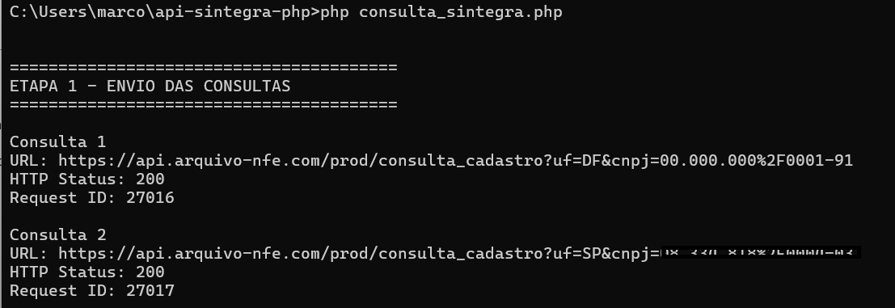
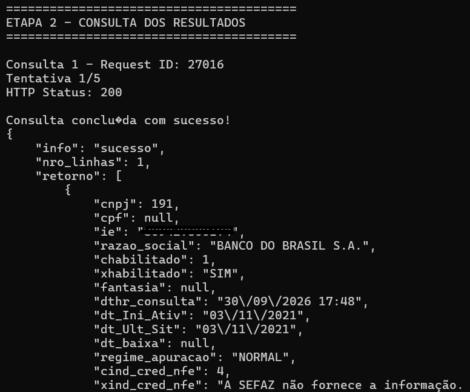
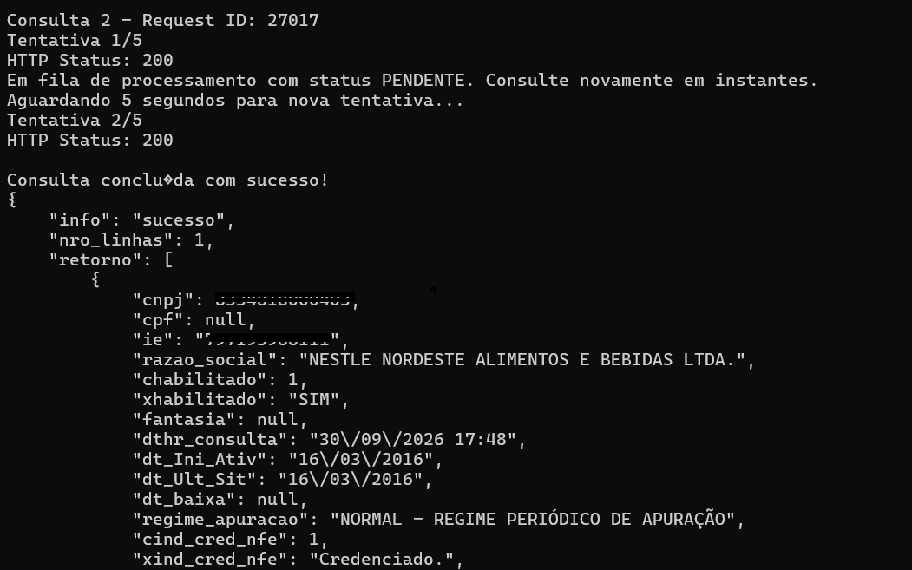

# Integração da API SINTEGRA em PHP – Consulta de Inscrição Estadual em tempo real

Exemplo de integração em **PHP** com a API SINTEGRA da **ArquivoNFe**, para consulta de dados cadastrais por UF.

A API permite realizar consultas utilizando **CNPJ, CPF ou Inscrição Estadual (IE)**, conforme a disponibilidade da consulta para cada UF.

## 🔎 Palavras-chave

* API SINTEGRA
* Consulta SINTEGRA
* SINTEGRA CCC
* Consulta Inscrição Estadual
* API Fiscal Brasil
* Consulta CNPJ
* Consulta CPF
* Consulta Inscrição Estadual por API
* API REST PHP
* Integração PHP com API

## Benefícios

✔ Consulta por CNPJ, CPF ou IE<br>
✔ Dados cadastrais retornados pela API<br>
✔ Integração simples via API REST<br>
✔ Processamento assíncrono utilizando `request_id`<br>
✔ Exemplo prático de integração em PHP<br>

## Casos de uso

✔ Validação cadastral antes da emissão de NF<br>
✔ Conferência cadastral automática<br>
✔ Verificação de informações de empresas e contribuintes<br>
✔ Integração com sistemas ERP e aplicações próprias<br>
✔ Processos de KYC (Know Your Customer)<br>

## Diferenciais

✔ Consulta dos dados cadastrais disponibilizados pela SEFAZ da UF consultada.<br>
✔ Comunicação segura por HTTPS.<br>
✔ Infraestrutura hospedada na Oracle Cloud no Brasil.<br>
✔ Painel web para configurações, consultas manuais e acompanhamento das integrações via API.<br>
✔ API REST com suporte a consultas por CNPJ, CPF ou Inscrição Estadual.<br>

---

## 🚀 Requisitos

* Windows ou Linux
* PHP 8.5 ou superior
* Extensão cURL habilitada
* Git (opcional, caso escolha clonar o projeto)

---

## ⚙️ Como utilizar

### 1️⃣ Cadastre-se gratuitamente

Acesse o portal:

https://portal.arquivo-nfe.com

Crie sua conta para obter acesso à API.

---

### 2️⃣ Copie seu Token

Após o login no portal:

1. Acesse o menu **Meu Token**.
2. Copie seu token de acesso.

> ⚠️ **Nunca publique seu token de acesso no GitHub.**

No arquivo `consulta_sintegra.php`, informe seu token apenas localmente:

```php
$TOKEN = "SEU_TOKEN_AQUI";
```

Antes de publicar o código no GitHub, certifique-se de que o token não esteja preenchido.

---

### 3️⃣ Instalação do PHP

O exemplo utiliza **PHP 8.5 ou superior**, com a extensão cURL habilitada.

#### Windows

Baixe o PHP pelo site oficial:

https://windows.php.net/download/

Selecione a versão Windows x64 e baixe o arquivo ZIP.

Extraia o conteúdo em uma pasta, por exemplo:

```text
C:\php
```

Configure a variável de ambiente `PATH` do Windows para incluir a pasta do PHP:

```text
C:\php
```

Abra um novo **Prompt de Comando (CMD)** e verifique a instalação:

```bash
php -v
```

O comando deverá apresentar a versão instalada, por exemplo:

```text
PHP 8.5.x (cli)
```

Verifique se a extensão cURL está habilitada:

```bash
php -m | findstr /I curl
```

O resultado esperado é:

```text
curl
```

#### Linux

Verifique se o PHP está instalado:

```bash
php -v
```

Caso não esteja instalado, no Ubuntu/Debian utilize:

```bash
sudo apt update
sudo apt install php-cli php-curl
```

Depois confirme:

```bash
php -v
php -m | grep curl
```

---

### 4️⃣ Configuração do certificado SSL

Para realizar as requisições HTTPS com validação de certificados, o PHP precisa localizar os certificados CA confiáveis.

No Windows, caso seja apresentado erro de certificado SSL, baixe o arquivo `cacert.pem`:

https://curl.se/ca/cacert.pem

Salve o arquivo, por exemplo, em:

```text
C:\php\extras\ssl\cacert.pem
```

Abra o arquivo `php.ini` e configure:

```ini
curl.cainfo = "C:\php\extras\ssl\cacert.pem"
openssl.cafile = "C:\php\extras\ssl\cacert.pem"
```

Salve as alterações e execute novamente o script.

> A validação SSL deve permanecer habilitada para garantir a comunicação segura via HTTPS.

---

### 5️⃣ Baixe o projeto

Você pode baixar o projeto diretamente pelo GitHub ou cloná-lo utilizando o Git.

#### Opção 1 — Baixar ZIP

No GitHub, clique em:

**Code → Download ZIP**

Depois, extraia o arquivo em uma pasta do seu computador.

#### Opção 2 — Clonar com Git

Se o Git estiver instalado, execute:

```bash
git clone https://github.com/mnogueira-tecnologia/api-sintegra-php.git
```

Depois acesse a pasta do projeto:

```bash
cd api-sintegra-php
```

---

### 6️⃣ Configure seu Token

Abra o arquivo [`consulta_sintegra.php`](consulta_sintegra.php) e informe seu token de acesso:

```php
$TOKEN = "SEU_TOKEN_AQUI";
```

Por exemplo:

```php
$TOKEN = "123456789abcdef";
```

> ⚠️ **O token acima é apenas um exemplo. Nunca utilize ou publique tokens reais no GitHub.**

Antes de executar o projeto, certifique-se de que o token esteja configurado corretamente.

---

### 7️⃣ Execute o exemplo

Com o PHP instalado, a extensão cURL habilitada e o token configurado, abra o terminal na pasta do projeto e execute:

#### Windows

```bash
php consulta_sintegra.php
```

#### Linux

```bash
php consulta_sintegra.php
```

O script realizará as consultas configuradas no exemplo e exibirá os resultados retornados pela API no terminal.

O exemplo demonstra:

* envio de consultas por CNPJ, CPF ou Inscrição Estadual;
* armazenamento do `request_id` (protocolo da consulta);
* consulta dos resultados de forma assíncrona;
* novas tentativas quando a consulta ainda está em processamento;
* tratamento das respostas da API;
* exibição dos resultados em formato JSON.

O código-fonte completo está disponível em:

[`consulta_sintegra.php`](consulta_sintegra.php)

---

## 🔄 Fluxo de consulta assíncrona

A API utiliza processamento assíncrono baseado em `request_id`. **As consultas normalmente apresentam retornos muito rápidos, podendo ocorrer em milissegundos ou segundos**, dependendo da consulta e dos sistemas envolvidos.

**Fluxo:**

1. **Sem `request_id`** → inicia a consulta e retorna o `request_id`.
2. **Com `request_id`** → retorna o resultado da consulta.

Essa arquitetura evita manter a sessão aguardando o processamento, que pode depender de sistemas externos, como o SINTEGRA.

### 📦 Consultas em lote

Para consultar várias empresas, a aplicação pode:

Enviar todas as requisições e armazenar os request_id retornados.

Percorrer novamente o lote e consultar os resultados.

Enquanto as demais requisições são enviadas, as primeiras provavelmente já terão sido processadas. Assim, quando a aplicação consulta os respectivos request_id, boa parte dos resultados, senão todos, já poderá estar disponível.

---

## 📄 Exemplo de retorno da API

O exemplo abaixo apresenta as etapas de execução e os retornos da API:







---

## 🔗 Documentação da API

Consulte a documentação completa da API SINTEGRA:

https://www.arquivo-nfe.com/api-sintegra-ccc

---

## ⭐ Apoie o projeto

Se este projeto foi útil para você:

⭐ **Deixe uma estrela no repositório.**

Isso ajuda outras pessoas a encontrarem este exemplo de integração.

---

Made with ❤️ by **ArquivoNfe**

https://www.arquivo-nfe.com
